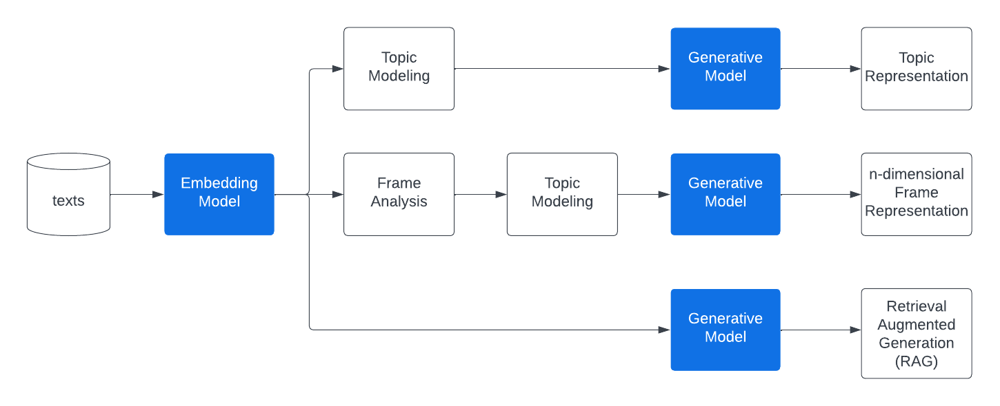
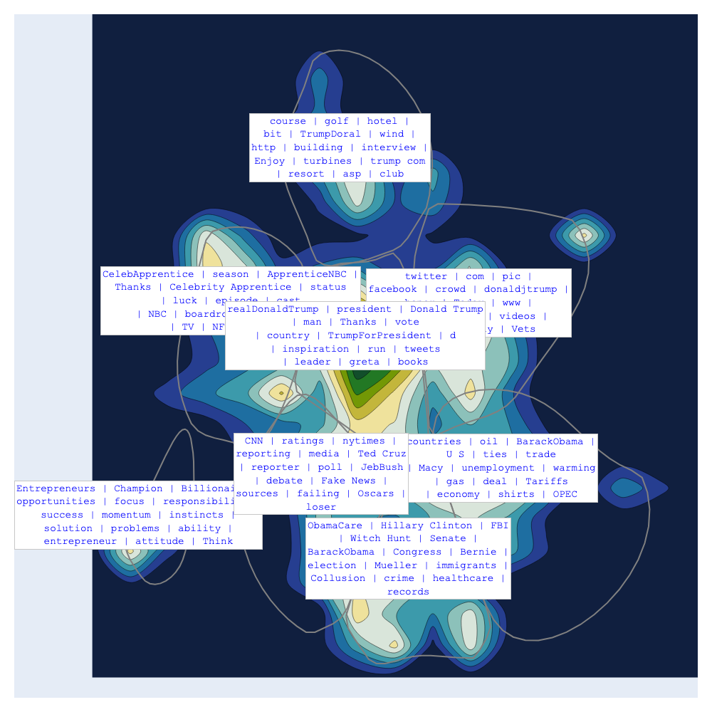
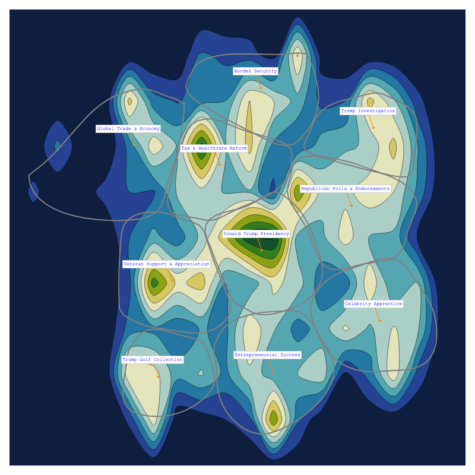
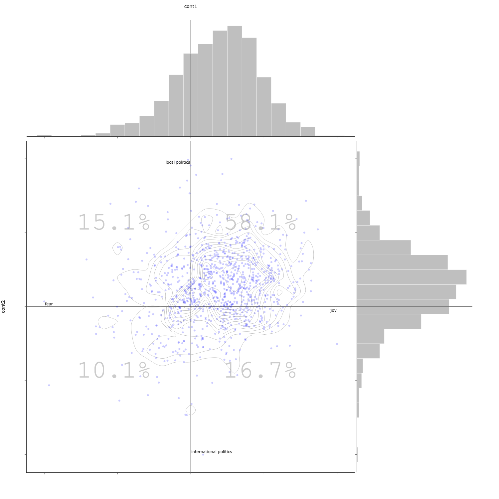

[](https://pypi.org/project/bunkatopics/)
[](https://pypi.org/project/bunkatopics/)
[](https://pepy.tech/project/bunkatopics)
[](https://pepy.tech/project/bunkatopics)

# Bunkatopics


Bunkatopics is a Topic Modeling Visualisation, Frame Analysis & Retrieval Augmented Generation (RAG) package that leverages LLMs. It is built with the same philosophy as [BERTopic](https://github.com/MaartenGr/BERTopic) but goes deeper in the visualization to help users grasp quickly and intuitively the content of thousands of text, as well as giving the opportunity to the user to create its own frames.

Bunkatopics is built on top of [langchain](<https://python.langchain.com/docs/get_started/introduction>).

## Installation via pip

First, create a new virtual environment using pyenv

```bash
pyenv virtualenv 3.10 bunkatopics_env
```

Activate the environment

```bash
pyenv activate bunkatopics_env
```

Then Install the Bunkatopics package:

```bash
pip install bunkatopics==0.42
```

## Pipeline



## Installation via Git Clone

```bash
pip install poetry
git clone https://github.com/charlesdedampierre/BunkaTopics.git
cd BunkaTopics

# Create the environment from the .lock file. 
poetry install # This will install all packages in the .lock file inside a virtual environmnet

# Start the environment
poetry shell
```

## Colab Example

| Name  | Link  |
|---|---|
| Visual Topic Modeling With Bunkatopics  | [](https://colab.research.google.com/drive/1DtPrI82TYepWLoc4RwuQnOqMJb0eWT_t?usp=sharing)  |

## Quick Start

Install the spacy tokenizer model for english:

```bash
python -m spacy download en_core_web_sm
```

We start by Loading Trump data from HuggingFace datasets

```python

from bunkatopics.functions.clean_text import clean_tweet
import random
from datasets import load_dataset

dataset = load_dataset("rguo123/trump_tweets")["train"]["content"]
full_docs = random.sample(dataset, 5000)
full_docs = [clean_tweet(x) for x in full_docs] # Cleaning the tweets
full_docs = [x for x in full_docs if len(x)>50] # Removing small tweets, they are not informative enough

```

You can the load any embedding model from langchain. Some of them might be large, please check the langchain [documentation](https://python.langchain.com/en/latest/reference/modules/embeddings.html)

## Topic Modeling

```python
from bunkatopics import Bunka
from langchain.embeddings import HuggingFaceEmbeddings

embedding_model = HuggingFaceEmbeddings(model_name="all-MiniLM-L6-v2") # We use a small model
bunka = Bunka(embedding_model=embedding_model)
bunka.fit(full_docs)

# Get the list of topics
bunka.get_topics(n_clusters = 20)
```

Then, we can visualize the topics computed

```python
bunka.visualize_topics( width=800, height=800)
```



## Topic Modeling with GenAI Summarization of Topics

You can get the topics summarized by Generative AI.
Use any model from Langchain. We use the 7B-instruct model of [Mistral AI](<https://mistral.ai/news/announcing-mistral-7b/>) thought [llama.cpp](<https://github.com/ggerganov/llama.cpp>) and the [langchain integration](<https://python.langchain.com/docs/integrations/llms/llamacpp>).

```python
import os
from langchain.llms import HuggingFaceHub

# Using Mistral AI to Summarize the topics

llm = HuggingFaceHub(repo_id = 'mistralai/Mistral-7B-v0.1', huggingfacehub_api_token = os.environ.get("HF_TOKEN")
)
df_topics = bunka.get_clean_topic_name(generative_model = llm)
print(df_topics)
bunka.visualize_topics( width=800, height=800)
```



## Retrieval Augmented Generation (RAG)

It is possible to to Retrieval Augmented Generation (RAG) thanks to langchain integration with different Generative Models.

```python
query = 'What is the  main fight of Donald Trump ?'
res = bunka.rag_query(query = query, generative_model = generative_model, top_doc = 5)
print(res['result'])
```

OUTPUT:

- The main fight of Donald Trump in the presidential elections of 2016 was against Hillary Clinton. He believed he was the best candidate for president and was able to beat many other candidates in the field due to his fame and political opinions.

```python
for doc in res['source_documents']:
    text = doc.page_content.strip()
    print(text)
```

OUTPUT:

- what do you say donald  run for president
- why only donald trump can beat hillary/n
- via    donald trump on who he likes for president  donald trump/n
- if the 2016  presidential field is so deep  why is donaldtrump beating so many of their  stars
- donald trump is a respected businessman with insightful political opinions

## Bourdieu Map

The Bourdieu map display the different texts on a 2-Dimensional unsupervised scale. Every region of the map is a topic described by its most specific terms.
CLusters are created and the names are also summarized using Generative AI.

The power of this visualisation is to constrain the axis by creating continuums and looking how the data distribute over these continuums. The inspiration is coming from the French sociologist Bourdieu, who projected items on [2 Dimensional maps](https://www.politika.io/en/notice/multiple-correspondence-analysis).

```python

from langchain.llms import HuggingFaceHub

llm = HuggingFaceHub(repo_id = 'mistralai/Mistral-7B-v0.1', huggingfacehub_api_token = os.environ.get("HF_TOKEN")
)

manual_axis_name = {
                    'x_left_name':'positive',
                    'x_right_name':'negative',
                    'y_top_name':'women',
                    'y_bottom_name':'men',
                    }

bourdieu_fig = bunka.visualize_bourdieu(
    generative_model=llm,
    x_left_words=["this is a positive content"],
    x_right_words=["this is a negative content"],
    y_top_words=["this is about women"],
    y_bottom_words=["this is about men"],
    height=800,
    width=800,
    display_percent=True,
    clustering=True,
    topic_n_clusters=10,
    topic_terms=5,
    topic_top_terms_overall=500,
    topic_gen_name=True,
    convex_hull = True,
    radius_size = 0.5,
    manual_axis_name = manual_axis_name
)
bourdieu_fig.show()
```



## Streamlit

Run Streamlit to use BunkaTopics with a nice front-end.

```bash
python -m streamlit run streamlit/app.py 
```

## Multilanguage

The package use Spacy to extract meaningfull terms for the topic represenation.

If you wish to change language to french, first, download the corresponding spacy model:

```bash
python -m spacy download fr_core_news_lg
```

```python
embedding_model = HuggingFaceEmbeddings(model_name="distiluse-base-multilingual-cased-v2")

bunka = Bunka(embedding_model=embedding_model, language = 'fr_core_news_lg')

bunka.fit(full_docs)
bunka.get_topics(n_clusters = 20)
```  

## Functionality

Here are all the things you can do with Bunkatopics

### Common

Below, you will find an overview of common functions in Bunkatopics.

| Method | Code  |
|-----------------------|---|
| Fit the model    |  `.fit(docs)` |
| Fit the model and get the topics  |  `.fit_transform(docs)` |
| Acces the topics   | `.get_topics(n_clusters=10)`  |
| RAG   | `.rag_query(query, generative_model)`  |
| Access the top documents per topic    |  `.get_clean_topic_name()` |
| Access the distribution of topics   |  `.get_topic_repartition()` |
| Visualize the topics on a Map |  `.visualize_topics()` |
| Visualize the topics on Natural Language Supervised axis | `.visualize_bourdieu()` |
| Access the Coherence of Topics |  `.get_topic_coherence()` |
| Get the closest documents to your search | `.search('politics')` |

### Attributes

You can access several attributes

| Attribute | Description |
|------------------------|---------------------------------------------------------------------------------------------|
| `.docs`               | The documents stores as a Document pydantic model |
| `.topics` | The Topics stored as a Topic pydantic model. |
