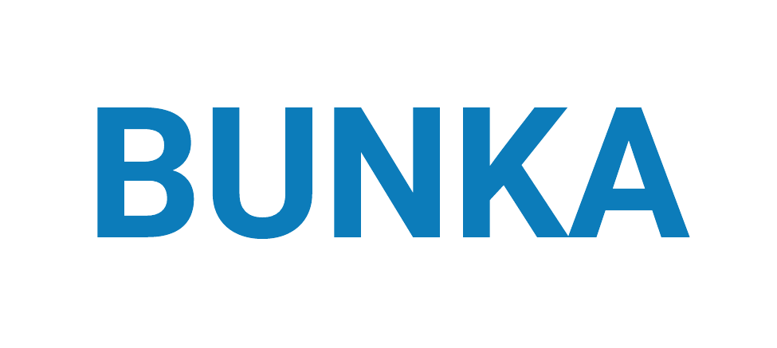

[](https://pypi.org/project/bunkatopics/)
[](https://pypi.org/project/bunkatopics/)
[](https://pepy.tech/project/bunkatopics)
[](https://pepy.tech/project/bunkatopics)

Please read our Documentation: [The Origin of Bunka](https://charlesdedampierre.github.io/BunkaTopics)

# Bunkatopics



Bunkatopics is a package designed for Topic Modeling Visualization, Frame Analysis, and Retrieval Augmented Generation (RAG) tasks, harnessing the power of Large Language Models (LLMs). Its primary goal is to assist developers in gaining insights from unstructured data, potentially facilitating data cleansing and optimizing LLMs through fine-tuning processes.
Bunkatopics is constructed using well-known libraries like langchain, chroma, and transformers, enabling seamless integration into various environments.

## Pipeline


## Installation via Pip

```bash
pip install bunkatopics
```

## Installation via Git Clone

```bash
git clone https://github.com/charlesdedampierre/BunkaTopics.git
cd BunkaTopics
pip install -e .
```

## Colab Example

| Name  | Link  |
|---|---|
| Visual Topic Modeling With Bunkatopics  | [](https://colab.research.google.com/drive/1DtPrI82TYepWLoc4RwuQnOqMJb0eWT_t?usp=sharing)  |

## Quick Start

### Uploading Sample Data

To get started, let's upload a sample of Medium Articles into Bunkatopics:

```python
from datasets import load_dataset
docs = load_dataset("bunkalab/medium")["train"]["title"]
```

You can the load any embedding model from langchain. Some of them might be large, please check the langchain [documentation](https://python.langchain.com/en/latest/reference/modules/embeddings.html)

### Choose Your Embedding Model

Bunkatopics offers seamless integration with Huggingface's extensive collection of embedding models. You can select from a wide range of models, but be mindful of their size. Please refer to the langchain documentation for details on available models.

```python
from bunkatopics import Bunka
from langchain_community.embeddings import HuggingFaceEmbeddings

# Choose your embedding model
embedding_model = HuggingFaceEmbeddings(model_name="all-MiniLM-L6-v2") # We recommend starting with a small model

# Initialize Bunka with your chosen model and language preference
bunka = Bunka(embedding_model=embedding_model, language='english') # You can choose any language you prefer

# Fit Bunka to your text data
bunka.fit(full_docs)

# Get a list of topics
df_topics = bunka.get_topics(n_clusters=15, name_length=3) # Specify the number of terms to describe each topic
print(df_topics)
```

### Visualize Your Topics

Finally, let's visualize the topics that Bunka has computed for your text data:

```python
bunka.visualize_topics(width=800, height=800)
```


## Topic Modeling with GenAI Summarization of Topics

Explore the power of Generative AI for summarizing topics!
We use the 7B-instruct model of [Mistral AI](<https://mistral.ai/news/announcing-mistral-7b/>) from the huggingface hub using the langchain framework.

```python
from langchain.llms import HuggingFaceHub

# Define the repository ID for Mistral-7B-v0.1
repo_id = 'mistralai/Mistral-7B-v0.1'

# Using Mistral AI to Summarize the Topics
llm = HuggingFaceHub(repo_id='mistralai/Mistral-7B-v0.1', huggingfacehub_api_token="HF_TOKEN")

# Obtain clean topic names using Generative Model
df_topics_clean = bunka.get_clean_topic_name(generative_model=llm)
print(df_topics_clean)

bunka.visualize_topics( width=800, height=800)
```

Finally, let's visualize again the topics

```python
bunka.visualize_topics(width=800, height=800)
```

## Retrieval Augmented Generation (RAG)

Experience Retrieval Augmented Generation (RAG) with Bunkatopics, enabled by seamless integration with various Generative Models from Langchain.

```python
from langchain.llms import HuggingFaceHub
# Define the repository ID for Mistral-7B-v0.1
repo_id = 'mistralai/Mistral-7B-v0.1'

# Define your query
query = 'What is the main focus of Donald Trump?'


# Using Mistral AI to Summarize the Topics
llm = HuggingFaceHub(repo_id=repo_id, huggingfacehub_api_token="HF_TOKEN")

# Execute RAG with your query and chosen generative model
res = bunka.rag_query(query=query, llm=generative_model, top_doc=5)

# Print the RAG-generated result
print(res['result'])
```

```python
# Display source documents used in the RAG process
for doc in res['source_documents']:
    text = doc.page_content.strip()
    print(text)
```

## Bourdieu Map

The Bourdieu map provides a 2-Dimensional unsupervised scale to visualize various texts. Each region on the map represents a distinct topic, characterized by its most specific terms. Clusters are formed, and their names are succinctly summarized using Generative AI.

The significance of this visualization lies in its ability to define axes, thereby creating continuums that reveal data distribution patterns. This concept draws inspiration from the work of the renowned French sociologist Bourdieu, who employed 2-Dimensional maps to project items and gain insights.

```python
from langchain.llms import HuggingFaceHub

# Define the HuggingFaceHub instance with the repository ID and API token
llm = HuggingFaceHub(
    repo_id='mistralai/Mistral-7B-v0.1',
    huggingfacehub_api_token="HF_TOKEN"
)

# Define custom axis names for the Bourdieu visualization
manual_axis_name = {
    'x_left_name': 'positive',
    'x_right_name': 'negative',
    'y_top_name': 'women',
    'y_bottom_name': 'men',
}

# Visualize data on the Bourdieu map
bourdieu_fig = bunka.visualize_bourdieu(
    generative_model=llm,
    x_left_words=["this is a positive content"],
    x_right_words=["this is a negative content"],
    y_top_words=["this is about women"],
    y_bottom_words=["this is about men"],
    height=800,
    width=800,
    display_percent=True,
    clustering=True,
    topic_n_clusters=10,
    topic_terms=5,
    topic_top_terms_overall=500,
    topic_gen_name=True,
    convex_hull=True,
    radius_size=0.5,
    manual_axis_name=manual_axis_name
)

# Display the Bourdieu map
bourdieu_fig.show()
```


## Streamlit

Run Streamlit to use BunkaTopics with a nice front-end.

```bash
pip install 'bunkatopics['front']' # Install front-related packages
python -m streamlit run streamlit/app.py 
```

## Contribution

If you have any questions, feedback, or would like to contribute, please don't hesitate to reach out!

Many thanks to Maarten Grootendorst for inspiring us with his groundbreaking work on Bertopics.
