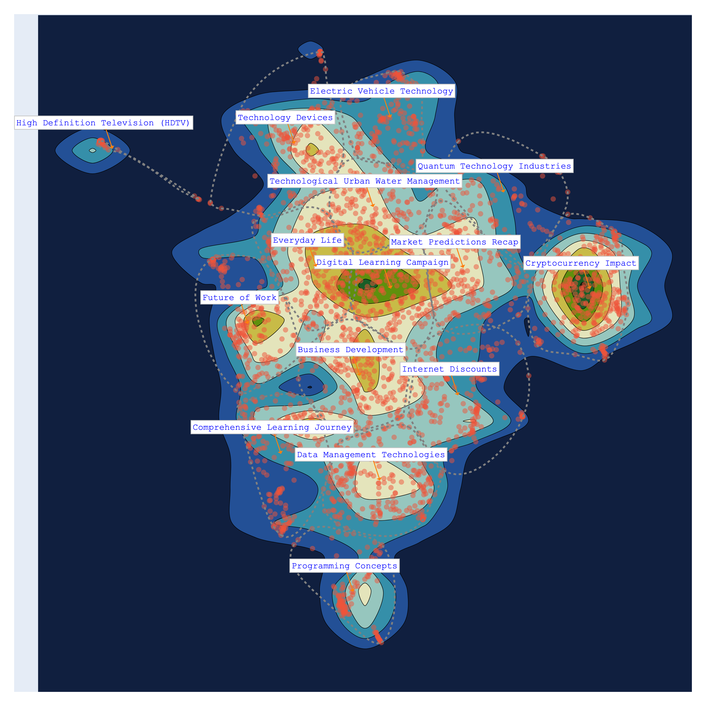
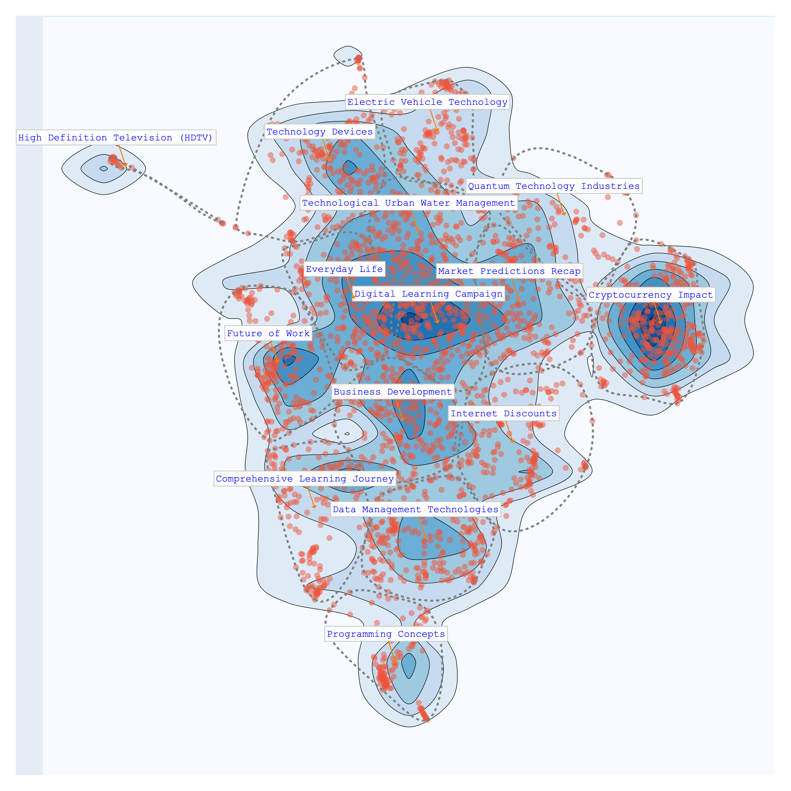

# Getting Started

## Installation via Pip

```bash
pip install bunkatopics
```

## Installation via Git Clone

```bash
git clone https://github.com/charlesdedampierre/BunkaTopics.git
cd BunkaTopics
pip install -e .
```

## Quick Start

### Uploading Sample Data

To get started, let's upload a sample of Medium Articles into Bunkatopics:

```python
from datasets import load_dataset
dataset = load_dataset("bunkalab/medium-sample-technology")["train"] # 'docs' is a list of text [text1, text2, ..., 
docs = list(dataset['title'])

```

### Choose Your Embedding Model

Bunkatopics offers seamless integration with Huggingface's extensive collection of embedding models. You can select from a wide range of models, but be mindful of their size. Please refer to the langchain documentation for details on available models.

```python
# Load Embedding model
from sentence_transformers import SentenceTransformer
embedding_model = SentenceTransformer(model_name_or_path="all-MiniLM-L6-v2")

# Load Projection Model
import umap
projection_model = umap.UMAP(
                n_components=2,
                random_state=42,
            )

from bunkatopics import Bunka

bunka = Bunka(embedding_model=embedding_model, 
            projection_model=projection_model, 
            language='english') # You can choose any language you prefer

# Fit Bunka to your text data
 bunka.fit(docs)
```

```python
# Get a clustering model
from sklearn.cluster import KMeans
clustering_model = KMeans(n_clusters=15)
>>> bunka.get_topics(name_length=5, 
                    custom_clustering_model=clustering_model)# Specify the number of terms to describe each topic
```

Topics are described by the most specific terms belonging to the cluster.

| topic_id | topic_name                   | size | percent |
|:--------:|:-----------------------------|:----:|:-------:|
|  bt-12   | technology - Tech - Children - student - days | 322  | 10.73  |
|  bt-11   | blockchain - Cryptocurrency - sense - Cryptocurrencies - Impact | 283  | 9.43   |
|  bt-7    | gadgets - phone - Device - specifications - screen | 258  | 8.6    |
|  bt-8    | software - Kubernetes - ETL - REST - Salesforce | 258  | 8.6    |
|  bt-1    | hackathon - review - Recap - Predictions - Lessons | 257  | 8.57   |
|  bt-4    | Reality - world - cities - future - Lot | 246  | 8.2    |
|  bt-14   | Product - Sales - day - dream - routine | 241  | 8.03   |
|  bt-0    | Words - Robots - discount - NordVPN - humans | 208  | 6.93   |
|  bt-2    | Internet - Overview - security - Work - Development | 202  | 6.73   |
|  bt-13   | Course - Difference - Step - science - Point | 192  | 6.4    |
|  bt-6    | quantum - Cars - Way - Game - quest | 162  | 5.4    |
|  bt-3    | Objects - Strings - app - Programming - Functions | 119  | 3.97   |
|  bt-5    | supply - chain - revolution - Risk - community | 119  | 3.97   |
|  bt-9    | COVID - printing - Car - work - app | 89  | 2.97   |
|  bt-10   | Episode - HD - Secrets - TV | 44  | 1.47   |

### Visualize Your Topics

Finally, let's visualize the topics that Bunka has computed for your text data:

```python
>>> bunka.visualize_topics(width=800, height=800, colorscale='YIGnBu')
```


## Topic Modeling with GenAI Summarization of Topics

Explore the power of Generative AI for summarizing topics!
We use the 7B-instruct model of [Mistral AI](<https://mistral.ai/news/announcing-mistral-7b/>) from the huggingface hub using the langchain framework.

```python
from langchain.llms import HuggingFaceHub

# Define the repository ID for Mistral-7B-v0.1
repo_id = 'mistralai/Mistral-7B-v0.1'

# Using Mistral AI to Summarize the Topics
llm = HuggingFaceHub(repo_id='mistralai/Mistral-7B-v0.1', huggingfacehub_api_token="HF_TOKEN")

# Obtain clean topic names using Generative Model
bunka.get_clean_topic_name(generative_model=llm, language='english')
bunka.visualize_topics( width=800, height=800, colorscale = 'Portland')
```

Finally, let's visualize again the topics. We can chose from different colorscales.

```python
>>> bunka.visualize_topics(width=800, height=800)
```

YlGnBu           |  Portland
:-------------------------:|:-------------------------:
  |  

delta           |  Blues
:-------------------------:|:-------------------------:
  |  

We can now access the newly made topics

```python
>>> bunka.df_topics_
```

| topic_id | topic_name                            | size | percent |
|:--------:|:--------------------------------------|:----:|:-------:|
|   bt-1   | Cryptocurrency Impact                 | 345  | 12.32   |
|   bt-3   | Data Management Technologies          | 243  | 8.68    |
|   bt-14  | Everyday Life                         | 230  | 8.21    |
|   bt-0   | Digital Learning Campaign              | 225  | 8.04    |
|   bt-12  | Business Development                  | 223  | 7.96    |
|   bt-2   | Technology Devices                    | 212  | 7.57    |
|   bt-10  | Market Predictions Recap               | 201  | 7.18    |
|   bt-4   | Comprehensive Learning Journey         | 187  | 6.68    |
|   bt-6   | Future of Work                        | 185  | 6.61    |
|   bt-11  | Internet Discounts                    | 175  | 6.25    |
|   bt-5   | Technological Urban Water Management  | 172  | 6.14    |
|   bt-9   | Electric Vehicle Technology            | 145  | 5.18    |
|   bt-8   | Programming Concepts                   | 116  | 4.14    |
|   bt-13  | Quantum Technology Industries          | 105  | 3.75    |
|   bt-7   | High Definition Television (HDTV)      | 36   | 1.29    |

## visualise Dimensions on topics

```python
dataset = load_dataset("bunkalab/medium-sample-technology-tags")
docs = list(dataset['Title'])
ids = list(dataset['doc_id'])
tags = list(dataset['tags'])

metadata = {'tags':tags}

from bunkatopics import Bunka

bunka = Bunka()

# Fit Bunka to your text data
bunka.fit(docs=docs, ids=ids, metadata=metadata)
bunka.get_topics(n_clusters=10)
bunka.visualize_topics(color = 'tags', width=800, height=800) # Add the metadata names
```

## Manually Cleaning the topics

If you are not happy with the resulting topics, you can change them manually. Click on Apply changes when you are done. In the example, we changed the topic **Cryptocurrency Impact** to **Cryptocurrency** and **Internet Discounts** to **Advertising**.

```python
>>> bunka.manually_clean_topics()
```


## Removing Data based on topics for fine-tuning purposes

You have the flexibility to construct a customized dataset by excluding topics that do not align with your interests. For instance, in the provided example, we omitted topics associated with **Advertising** and **High-Definition television**, as these clusters primarily contain promotional content that we prefer not to include in our model's training data.

```python
>>> bunka.clean_data_by_topics()
```


```python
>>> bunka.df_cleaned_
```

| doc_id    | content                                               | topic_id | topic_name                             |
|:---------:|:-----------------------------------------------------:|:--------:|:--------------------------------------:|
| 873ba315  | Invisibilize Data With JavaScript                    |   bt-8   | Programming Concepts                   |
| 1243d58f  | Why End-to-End Testing is Important for Your Team    |   bt-3   | Data Management Technologies            |
| 45fb8166  | This Tiny Wearable Device Uses Your Body Heat...     |   bt-2   | Technology Devices                      |
| a122d1d2  | Digital Policy Salon: The Next Frontier              |   bt-0   | Digital Learning Campaign               |
| 1bbcfc1c  | Preparing Hardware for Outdoor Creative Technology Installations |   bt-5   | Technological Urban Water Management   |
| 79580c34  | Angular Or React ?                                    |   bt-8   | Programming Concepts                   |
| af0b08a2  | Ed-Tech Startups Are Cashing in on Parents’ Insecurities |   bt-0   | Digital Learning Campaign               |
| 2255c350  | Former Google CEO Wants to Create a Government-Funded University to Train A.I. Coders |   bt-6   | Future of Work                          |
| d2bc4b33  | Applying Action & The Importance of Ideas             |   bt-12  | Business Development                   |
| 5219675e  | Why You Should (not?) Use Signal                      |   bt-2   | Technology Devices                      |
| ...       | ...                                                  |   ...    | ...                                    |

## Bourdieu Map

The Bourdieu map provides a 2-Dimensional unsupervised scale to visualize various texts. Each region on the map represents a distinct topic, characterized by its most specific terms. Clusters are formed, and their names are succinctly summarized using Generative AI.

The significance of this visualization lies in its ability to define axes, thereby creating continuums that reveal data distribution patterns. This concept draws inspiration from the work of the renowned French sociologist Bourdieu, who employed 2-Dimensional maps to project items and gain insights.

```python
from langchain.llms import HuggingFaceHub

# Define the HuggingFaceHub instance with the repository ID and API token
llm = HuggingFaceHub(
    repo_id='mistralai/Mistral-7B-v0.1',
    huggingfacehub_api_token="HF_TOKEN"
)

## Bourdieu Fig
bourdieu_fig = bunka.visualize_bourdieu(
        llm=llm,
        x_left_words=["This is about business"],
        x_right_words=["This is about politics"],
        y_top_words=["this is about startups"],
        y_bottom_words=["This is about governments"],
        height=800,
        width=800,
        clustering=True,
        topic_n_clusters=10,
        density=False,
        convex_hull=True,
        radius_size=0.2,
        label_size_ratio_clusters=80)
```

```python
>>> bourdieu_fig.show()
```

positive/negative vs humans/machines            |  politics/business vs humans/machines  
:-------------------------:|:-------------------------:
  |  

politics/business vs     positive/negative      |  politics/business vs startups/governments
:-------------------------:|:-------------------------:
  |  

## Saving and loading Bunka

```python
bunka.save_bunka("bunka_dump")
...

from bunkatopics import Bunka
bunka = Bunka().load_bunka("bunka_dump")


from sklearn.cluster import KMeans
clustering_model = KMeans(n_clusters=15)
>>> bunka.get_topics(name_length=5, 
                    custom_clustering_model=clustering_model)# Specify the number of terms to describe each topic
```

## Loading customed embeddings

```python
'''
ids = ['doc_1', 'doc_2'...., 'doc_n']
embeddings = [[0.05121125280857086,
  -0.03985324501991272,
  -0.05017390474677086,
  -0.03173152357339859,
  -0.07367539405822754,
  0.0331297293305397,
  -0.00685789855197072...]]

'''

pre_computed_embeddings = [{'doc_id': doc_id, 'embedding': embedding} for doc_id, embedding in zip(ids, embeddings)]
...

from bunkatopics import Bunka
bunka = Bunka()
bunka.fit(docs=docs, ids = ids, pre_computed_embeddings = pre_computed_embeddings)


from sklearn.cluster import KMeans
clustering_model = KMeans(n_clusters=15)
>>> bunka.get_topics(name_length=5, 
                    custom_clustering_model=clustering_model)# Specify the number of terms to describe each topic
```

## Front-end

This is a beta feature. First, git clone the repository

```bash
git clone https://github.com/charlesdedampierre/BunkaTopics.git
cd BunkaTopics
pip install -e .
```

Then carry out a Topic Modeling and launch the serveur:

```python
from bunkatopics import Bunka
from langchain_community.embeddings import HuggingFaceEmbeddings

# Choose your embedding model
embedding_model = HuggingFaceEmbeddings(model_name="all-MiniLM-L6-v2") # We recommend starting with a small model

# Initialize Bunka with your chosen model and language preference
bunka = Bunka(embedding_model=embedding_model, language='english') # You can choose any language you prefer

# Fit Bunka to your text data
bunka.fit(docs)
bunka.get_topics(n_clusters=15, name_length=3)# Specify the number of terms to describe each topic
```

```python
>>> bunka.start_server() # A serveur will open on your computer at http://localhost:3000/ 
```
